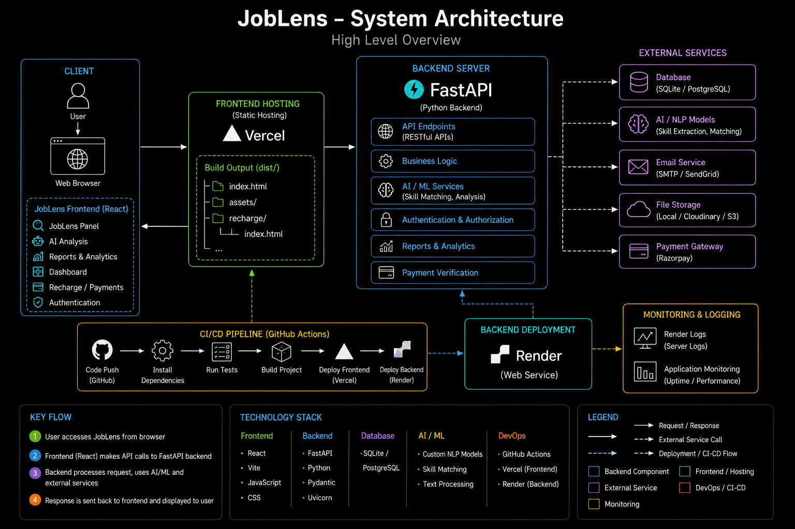
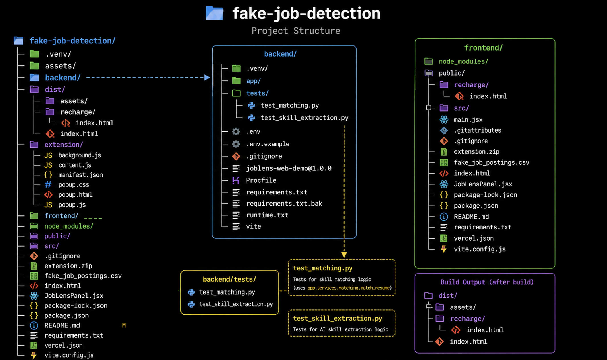
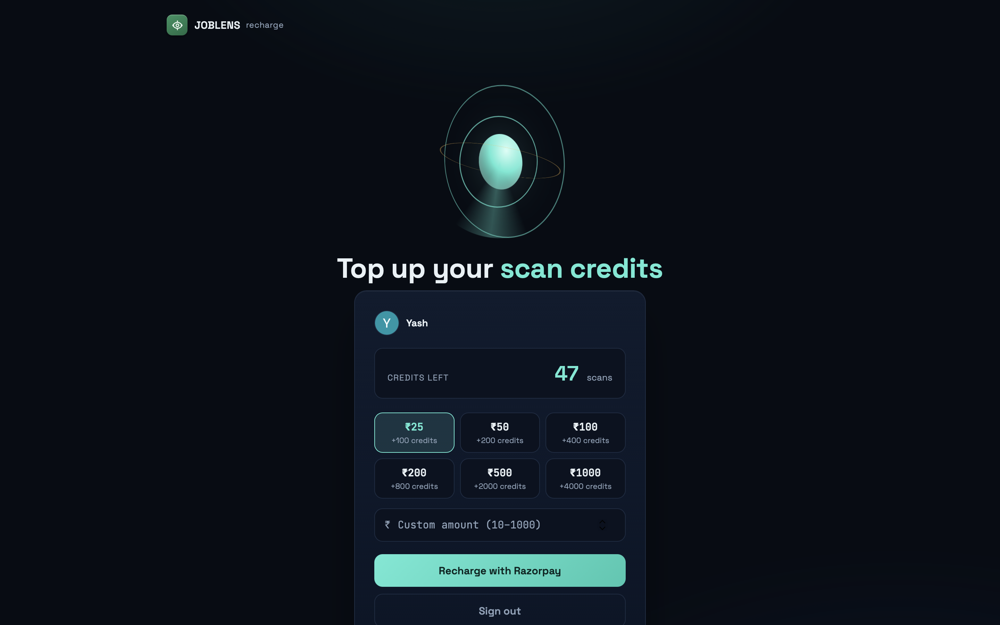
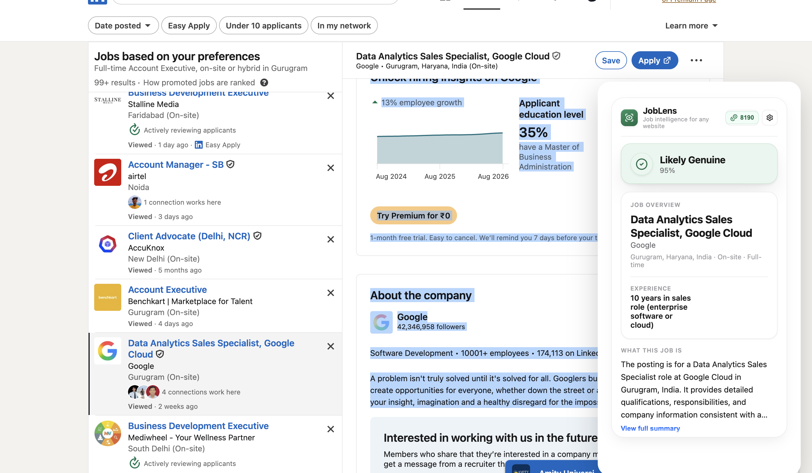

<h1 align="center">JobLens</h1>
<h3 align="center">
JobLens is an AI-powered job posting scam-detection and resume-matching platform. It combines a large language model, resume parsing, and location-agnostic browser tooling to help job seekers instantly verify a posting's legitimacy, understand what a role actually requires, and see how well their own resume matches it — before they ever apply.
</h3>
<h2>Live Demo</h2>

```bash
https://job-lensai.vercel.app
```
<p>The backend is deployed on Render, which automatically goes to sleep after a period of inactivity. On the first visit, it may take <b>1-2 minutes</b> for the backend to wake up. Please wait briefly before using the application.</p>


<h2>Features</h2>
<h3>Job Seeker Features</h3>

- AI Job Posting Scam Classification
- Automatic Job Detail Extraction (title, company, location, salary, work mode)
- AI-Extracted Skill List Per Posting
- Resume-to-Job Skill Matching
- Match Score, Matched Keywords & Missing Keywords
- Resume Upload & Parsing (PDF / DOCX)
- One-Click Analysis via Chrome Extension
- Credit-Based Usage System
- Secure Google Sign-In
- Recharge via Razorpay (fixed packs + custom amount)
<h3>Browser Extension Features</h3>

- Select-to-Analyze on Any Job Site
- Inline Result Panel Overlay
- Auto-Debounced Selection Handling
- Popup Dashboard with Credit Balance
- Cross-Origin Aware Communication with Backend
<h3>AI Features</h3>

- Groq-Hosted Large Language Model Analysis
- Scam Likelihood Reasoning (Genuine / Suspicious / Uncertain)
- Structured Job-Detail Extraction from Unstructured Text
- Role-Agnostic Skill Extraction (technical, sales, or any other domain)
- Evidence-Based Classification (avoids false positives on legitimate but unfamiliar postings)
<h3>Trust & Payments</h3>

- Razorpay Order Creation & Signature Verification
- Razorpay Webhook Fallback for Payment Confirmation
- Atomic Credit Deduction (no double-charge on concurrent requests)
- Idempotent Payment Verification
<h2>Technology Stack</h2>
<h3>Frontend</h3>

- React
- Vite
- Chrome Extension (Manifest V3)
<h3>Backend</h3>

- Python
- FastAPI
- MongoDB (via Motor, async driver)
- Gunicorn + Uvicorn Workers
<h3>Artificial Intelligence</h3>

- Groq API (Llama 3.3 70B)
- Large Language Models (LLMs)
- Prompt Engineering for Structured JSON Extraction
- Resume Parsing (PDF / DOCX)
<h3>Authentication & Payments</h3>

- Google OAuth 2.0
- JWT Authentication
- Razorpay Payment Gateway
<h3>Database & Cloud</h3>

- MongoDB Atlas
- Render (Backend)
- Vercel (Frontend)


<h2>Installation</h2>
<h3>Clone Repository</h3>

```bash
git clone https://github.com/Tanishttha/JobLens
cd JobLens
```
<h3>Install Dependencies</h3>
<p>Backend</p>

```bash
cd backend
python -m venv venv
venv\Scripts\activate      # Windows
source venv/bin/activate   # macOS/Linux
pip install -r requirements.txt
```
<p>Frontend</p>

```bash
cd ..
npm install
```
<h2>Environment Variables</h2>
<h3>Backend (.env)</h3>

```env
MONGODB_URI=YOUR_MONGODB_URI
MONGODB_DATABASE=joblens

JWT_SECRET=replace-with-a-long-random-secret

GOOGLE_CLIENT_ID=YOUR_GOOGLE_CLIENT_ID
GOOGLE_CLIENT_SECRET=YOUR_GOOGLE_CLIENT_SECRET
GOOGLE_REDIRECT_URI=http://localhost:8000/auth/google/callback

GROQ_API_KEY=YOUR_GROQ_API_KEY

RAZORPAY_KEY_ID=YOUR_RAZORPAY_KEY_ID
RAZORPAY_KEY_SECRET=YOUR_RAZORPAY_KEY_SECRET
RAZORPAY_WEBHOOK_SECRET=YOUR_RAZORPAY_WEBHOOK_SECRET

# ₹1 buys 4 credits: ₹25 = 100 credits
CREDITS_PER_RUPEE=4
```
<h3>Frontend (.env)</h3>

```env
VITE_API_BASE_URL=http://127.0.0.1:8000
```
<h2>Running the Project</h2>
<h3>Backend</h3>

```bash
cd backend
uvicorn app.main:app --reload --port 8000
```
<h3>Frontend</h3>

```bash
npm run dev
```
<h3>Chrome Extension</h3>

```bash
1. Open chrome://extensions
2. Enable Developer Mode
3. Click "Load unpacked" and select the extension/ folder
```
<h2>Application URLs</h2>
<p><b>Frontend</b></p>

```
http://127.0.0.1:5173
```
<p><b>Backend</b></p>

```
http://127.0.0.1:8000
```
<h2>Screenshots</h2>

  

<h2>Deployment</h2>
<p>Frontend - Vercel</p>
<p>Backend - Render</p>
<p>Database - MongoDB Atlas</p>
<h2>Security Features</h2>

- Google OAuth 2.0 Sign-In
- JWT-Based Session Authentication
- Razorpay Signature Verification on Every Payment
- Razorpay Webhook Fallback with HMAC Verification
- Atomic Credit Deduction to Prevent Race Conditions
- Resume Ownership Validation Before Analysis
<h2>Roadmap</h2>

- Persisted Analysis History Dashboard
- Rate Limiting on Public Endpoints
- Improved Skill Matching for Non-Technical Roles
- Multi-Language Job Posting Support
- Firefox / Edge Extension Ports
- Team / Recruiter-Facing Verification Tools
<h2>License</h2>
This project is developed for educational, research, and social impact purposes.